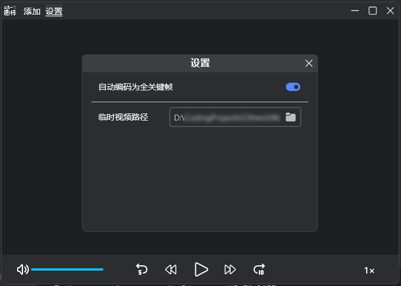
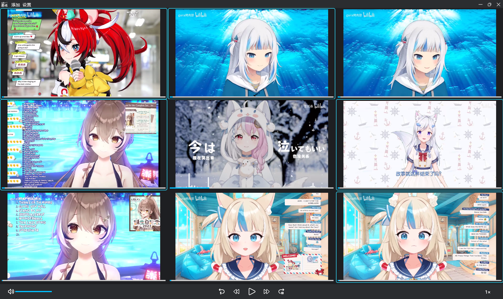

 

 

>   最近了解到 英伟达的图像比较与分析工具`ICAT`，功能非常完善，建议大家优先下载。
>
>   https://www.nvidia.cn/geforce/technologies/icat/
>
>   本应用也会继续更新，尽力优化体验。

# WotaScope

​	可对多个视频进行逐帧对比的应用。

​	本应用使用 `Compose Multiplatform` 开发，使用 `ffmpeg` 作为视频编码引擎，使用 `vlcj` 作为视频播放内核，遵守 `GPLv3` 协议。

​	支持对最多九个视频进行统一控制与逐帧播放。

## 一、使用方式

-   **支持的视频格式**

    `.mp4` `.avi` `.mkv` `.flv` `.mov` `.wmv`

    建议格式为`.mp4`和`.mov`，其他格式可能无法编码为全关键帧逐帧播放。

-   **如何下载**

​	请在[此处（github）](https://github.com/lolicer/WotaScope/releases)或[此处（gitee）](https://gitee.com/lolicer/WotaScope/releases)获取最新版本。

-   **如何使用**

​	像普通的软件一样，安装、打开，然后使用。:)

>   ​	初次打开应用以及初次导入视频时会有短暂卡顿。

​	绝大多数视频为了节省空间，并不会把每一帧的画面存储为完整的图像，而是依赖关键帧（I帧）生成前向预测帧（P帧）和双向预测帧（B帧），这使逐帧播放比较麻烦。开启 `自动编码为全关键帧` 选项，会检测视频第一秒是否全为关键帧，并将 `非全关键帧视频` 编码为 `全关键帧视频` ，保证逐帧播放时画面正常。

​	若 `临时视频路径` 为默认路径，即安装目录下的 `temp_videos` 文件夹，编码后的视频将会在程序退出时删除。

>   ​	如果关闭应用时没有将视频从应用中移除，则视频会在下一次关闭应用时删除。

​	最多支持同时播放九个本地视频，可通过点击视频画面选中/取消。

>   ​	有蓝框为选中状态，无蓝框为非选中状态。
>
>   ​	默认为选中状态。

-   **如何卸载**

    应用暂未提供卸载程序，卸载方式如下：

    -   方法一：设置→应用→应用和功能→应用列表→卸载；

    -   方法二：直接删除整个安装文件夹。

>    	本应用不会在系统盘留下任何垃圾文件/文件夹，但似乎会将设置保留在注册表`HKEY_LOCAL_MACHINE\SOFTWARE\JavaSoft\Prefs`中，具体在哪我也没找到qwq。

##  二、当前BUG/后续优化

-   BUG - 编码状态显示不完全正确；

- 添加快捷键；

- 使用JNI（或其它什么方法）调用Windows原生的文件/文件夹选择器，取代当前的JVM选择器；

- 针对不同视频BPM不同的问题进一步优化；

- 添加流媒体支持；

- 实现更自由的布局，如裁切/重合、镜像视频；

- 优化主题色，添加亮色模式。

## 三、图标来源

- https://github.com/microsoft/fluentui-system-icons

    `media_fastforward.svg`: `fluent:fast-forward-24-regular`

    `media_pause.svg`: `fluent:pause-24-regular`

    `media_play.svg`: `fluent:play-24-regular`

    `media_rewind.svg`: `fluent:rewind-24-regular`

    `title_escape.svg`: `fluent:dismiss-24-regular`

    `title_maximize.svg`: `fluent:maximize-24-regular`

    `title_minimize.svg`: `fluent:minimize-24-regular`

    `title_restore.svg`: `fluent:restore-16-regular`

    `settings_toggle_on.svg`: `fluent:toggle-right-16-filled`

    `settings_toggle_off.svg`: `fluent:toggle-left-16-filled`

    `settings_folder.svg`: `fluent:folder-24-filled`

- https://github.com/tabler/tabler-icons

    `media_skip_back_5.svg`: `tabler:rewind-backward-5`

    `media_skip_forward_10.svg`: `tabler:rewind-forward-10`

    `media_menu.svg`: `tabler:menu-2`

    `volume_0.svg`: `tabler:volume-3`

    `volume_1.svg`: `tabler:volume-2`

    `volume_2.svg`: `tabler:volume`

- https://github.com/Tencent/tdesign-icons

    `media_close.svg`: `tdesign:close-circle-filled`

-   ~~某只粉发粉瞳的魅魔~~

## 五、感谢

| 项目名                                 | 网址                                                         |
| -------------------------------------- | ------------------------------------------------------------ |
| FFmpeg                                 | https://ffmpeg.org/                                          |
| VLC/vlcj                               | https://github.com/caprica/vlcj/tree/vlcj-4.x                |
| constraintlayout-compose-multiplatform | https://github.com/Lavmee/constraintlayout-compose-multiplatform |
| multiplatform-settings                 | https://github.com/russhwolf/multiplatform-settings          |
| rjuszczyk                              | https://github.com/rjuszczyk/ComposeVideoPlayer              |

